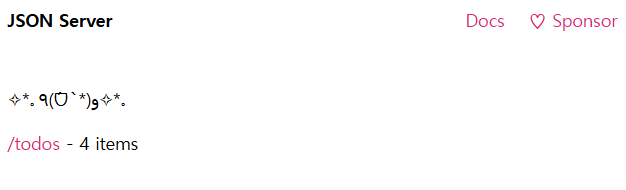

# 10_vue(기본)
## axios를 이용한 HTTP 통신

1. axios-test-app 프로젝트를 생성하세요.
2. 프로젝트 루트에 db.json을 다음과 같이 정의하세요.
3. db.json 을 db 로 하여 json server를 서버로 실행하세요.  
  
**figure. 1.** 서버 실행 결과  

5. VS Code 확장팩 Thunder Client 를 설치하세요. Thunder Client 를 이용해서 todo rest 서버를 대상으로 CRUD 테스트를 진행하세요.
